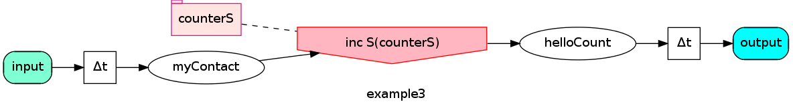

SinapseGrid
===========

Feature highlights
------------------

1. SinapseGrid allows function composition far more flexible than monads.
2. Strictly typed message handling in Akka actors (a bit more natural than in Typed actors).
3. Multi input/multi output functions.
4. Systems process portions of information ASAP.
5. Declarative composition in the form of DataFlow diagram.

See also
--------

1. [README.md in Russian](docs/README.RU.md) until the complete translation appear here.
2. [Motivation for SinapseGrid](docs/SpeechPortalMotivation.RU.md)
3. [License (BSD-like)](LICENSE)
