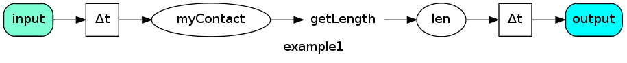
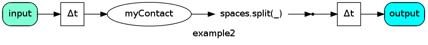

SynapseGrid contact system
==========================

Key features
------------
1. SynapseGrid provides better opportunity for function composition, which goes far beyond monad capabilities.
2. Mutual usage with Akka-actors allows strictly typed data processing, that significantly excels Typed actors.
3. Composite functions, that have multiple inputs and outputs.

(Reasons, that led us to create SynapseGrid could be found here: [Потребности систем ведения диалога](docs/SpeechPortalMotivation.RU.md). )

Breadboard concept
------------------
Contact System is based on some principles, that are lightened here.

Imagine a breadboard for assembling an electronic circuit.
There is bunch of apertures and contact areas. Some contacts are arranged for apt electronic device connections while others are auxiliary,
 and used to link components.

There are different components (impedors, transistors), installed on the breadboard. The components are atomic from our point of view.
There are also subsystems like: power supply, low frequency amplifier, filter and etc. Those subsystems are themselves made up of a few components (not atomic).
Some subsystems may stay unclaimed and left without any components installed.
Simultaneously some contacts that belong to a subsystem may not be involved and may simply "hang".

For instance, some output voltages in a power supply may be unused. Or some inputs of a general purpose microcircuit may be unused.

Breadboard is a good metaphor that illustrates SynapseGrid contact system.

Contacts and links
------------------
The Contact is an instance of <code>Contact[T]</code> type that has a name, that usually matches the variable name.
(In future it is planned to implement a macro that will ensure this property.)
It's very easy to create a simple instance of Contact:

<pre>
	val myContact = contact[String]("myContact")
</pre>
(All examples are written in Scala. However, the same things can usually be done in Java.)

Contact doesn't contain any data. It designates a point on the breadboard. You may consider it as an assigned name on the breadboard.
The <code>myContact</code> may have connections to component's inputs and outputs of type String.

The component that has one input and one output is called an arrow or a link.

An ordinary Scala function is already a component/(a link) that can be connected to contacts:

<pre>
	def getLength(s:String) = s.length
</pre>

Let's write a code, that calculates length of an incoming string.

<pre>
	val len = contact[Int]( "len" )
	myContact -> len map getLength
</pre>

or, briefly

<pre>
	val len = myContact.map( _.length )
</pre>
(In the latter case, the `len` contact of inferred type <code>Contact[Int]</code> is created automatically.)

The system picture is shown below (to make testing possible, additional contacts have been connected: `input`, `output`).

Data processing
---------------

### Signals

The code above, doesn't do actual job, because nor contacts neither functions store any data.
This code only declares the system's structure - Contacts, Components and their interconnections.

In order to actually process some data we need a way to associate the data with the contact. We call this
"external binding". A dedicated object is created that holds the contact and the data bound to it.
In Contact System terminology this object is called a Signal:

<pre>
	case class Signal[T](contact:Contact[T], data:T)
</pre>

(This object is often referred to as Event, Data, Frame or Message.)
System transient state is represented as a list of signals:

<pre>
	type Signals = List[Signal[_]]
</pre>

The list represents all data attached to corresponding contacts in one discrete time moment.

### SignalProcessor

SignalProcessor performs a functional transformation of the original list of signals to the subsequent list.
Each signal in order is put into the input of each component which is connected to the corresponding contact.
The component transforms the received data (signals) according to it's logic and produces zero, one or more output data items.
The results of component's transformation are associated with the contact to which the component's output is connected.
The data items are converted into signals which are added to the system's state for the next time moment.
Signal Processor exits, when all signals of the current time moment have been processed.

The theory of hidden Markov models has a good notion of <b>trellis</b> (the time chart of signals; scan of signals along the discrete time).
SignalProcessor builds the trellis starting from input data.

When the trellis building stops?
If the process does not stop, then all data will reach the outer contacts and, as far as there are no connected components,
all data will be lost. To avoid this, output contacts are specified in system description:

<pre>
	outputs(len) // outputs(output1, output2, output3)
</pre>

therefore, processing will stop, when all signals in the current list belong to output contacts.

Arrow types
-----------

The most common situation in signal processing is when 0 or more output elements are generated per one input element.
Such situation is traditionally handled in Scala via high-order function called flatMap.
That's why an arrows, annotated by functions, that return 0..n elements has a FlatMap type.

<pre>
	val wordsContact = someStringContact.flatMap(_.split("\\s+".r))
</pre>

For a string "hello bye" two elements are produced - "hello", "bye". In terms of signals:

<pre>
 val inputSignals = List(Signal(someStringContact, "hello bye"))
 val outputSignals = List(Signal(wordsContact, "hello"), Signal(wordsContact, "bye"))
</pre>

System will look like this:

An important case of FlatMap arrows are 0..1 arrows, which either pass data or not depending on a certain condition.
There's also a <code>filter</code> method, dedicated to create this kind of arrows:

<pre>
	val nonEmptyString = myContact.filter( _.length > 0 )
</pre>

For-comprehension compatibility
-------------------------------

An interesting feature of the Scala is the ability to use syntactic sugar for custom methods.
Methods like map, flatMap, filter or withFilter, are already announced, so, it's possible to use a for-comprehension:

<pre>
	val helloContact = for {
	   s <- myContact
	   if s.length >0
	} yield "Hello, "+s
</pre>

The same code you may find below (iе contains two arrows):

<pre>
	val helloContact = myContact.filter(s => s.length>0).map(s=>"Hello, "+s)
</pre>

In some cases, when the processing algorithm branches not too much, this syntax looks pretty good.

Working with state
------------------

Till now, all examples operated only with the data on the input contact. The result hasn't been stored inside the system.
We have been using "pure" immutable functions without side-effects. These functions have a lot of useful characteristics.
For example, we could easily parallelize data processing.
There's no need to recreate the system to perform processing of another data — on-start one time creation is enough.
Also, there's usually no need to debug such systems - the absence of side-effects makes the result to be determined 
only by input data.

If data processing logic requires state saving - the most obvious solution is to use a variable inside 
the function to store the state:

<pre>
	var counter = 0
	val helloCount = myContact.map({any => 	counter += 1;  counter})
</pre>

This will work, alas we're losing all the advantages of an immutable system.

But what if we store the state separately from the component that requires it? And then, in the proper time before the function call,
the state is evoked and after processing it is put back.

How to work with the state, stored elsewhere? A function has to accept the current state on input and return the new state value.

<pre>
	val helloCount = myContact.[link to variable, where counter state is stored].map({(any, counter) => (counter+1, counter + 1)})
</pre>

Let's take a closer look to this function. We'll make it verbose via def:

<pre>
	def incCounter(any:String, counter:Int) : (Int, Int) = {
	  val newCounterValue = counter+1
	  val resultOfThisFunction = newCounterValue
	  return (resultOfThisFunction, newCounterValue)
	}
</pre>

The function, that process the state is pure. Q.e.d.
It can be parallelized, once-created, zero-debugged. 

It only moment left is to determine how to store and retrieve the state easily.

We will use <code>StateHandle[T]</code> (some sort of Contact), to identify the state variable

<pre>
	val counterS = state[Int]("counterS", 0)
	val helloCount = contact[Int]("helloCount")
</pre>

This identifier contains variable type, name, and the initial value.

<code>counterS</code> is not available for an immediate update. Actually it's not stored anywhere yet.
It will only be present during the signal processing in runtime.

To use this state in our helloCounter function, we have to refer to it somehow:

<pre>
    (myContact.withState(counterS) -> helloCount).stateMap({(counter: Int, any:String) => (counter + 1, counter + 1)},"inc "+counterS)
	val helloCount = myContact.stateMap(counterS, {(any, counter) => (counter+1, counter + 1)})
</pre>

It looks a little bit cumbersome, but we have all the advantages of pure functions.

![example3 system picture][example3]

[example3]: images/example3.png "System example #3"

Synapse Grid DSL provides a set of other high-order functions, that simplify working with states (<code>zipWithState</code>,
<code>getState</code>, <code>saveTo</code> and others).

Drawing the system scheme
-------------------------

Since it's a declarative system, there is a great chance to study and analyse it through the system's graph.

To get system's image, <code>toDot</code> call is sufficient.
This method traverses all system elements (contacts, arrows, subsystems) and generates a text in [.dot format](http://www.graphviz.org/Documentation.php).

You can view .dot files via XDot or other appropriate software.
All pictures in the <code>images</code> folder have been obtained by the following command:

<pre>
    dot -Tpng example3.dot > example3.png
</pre>

System construction with SystemBuilder
--------------------------------------
The DSL for arrows/contacts creation is mostly declared in the <code>SystemBuilder</code>.
It contains basic methods, that allows you to incrementally create contacts or different sort of arrows/links.
SystemBuilder is a mutable class. It doesn't participate in runtime-processing.
To get the clear system description, constructed by SystemBuilder, call <code>toStaticSystem</code> method.
This method returns simple immutable case-class <code>StaticSystem</code> , which contains all contacts and arrows.

There are some other DLS's that are stored in separate traits. To use them, simple mix-in to your Builder.

There are two ways to get DSL in scope. The first one is to create an instance of SystemBuilder and import it's methods:

<pre>
	val sb = new SystemBuilderC("MySystem")
	import sb._
	...
	val system = toStaticSystem
</pre>

The other one (the preferred one) is to extend the SystemBuilder trait:

<pre>
	trait MySystemBuilder extends SystemBuilder {
	  // setSystemName("MySystem") 
	  ...
	}

	val system = new MySystemBuilder.toStaticSystem
</pre>

After receiving the <code>StaticSystem</code>, it is then converted to RuntimeSystem. The runtime system can be considered 
as a map of contacts to the handlers list. 

The runtime system is further converted to RuntimeComponent that has simple functional interface. It can be directly 
used for signal processing.
However one has to do the housekeeping — store the state of the system somewhere. To simplify it there is a
<code>DynamicSystem</code> class (<code> DynamicSystem == RuntimeComponent + State</code>), 
that can be used to manage the state.

You can use this class as an ordinary function that processes signals and produces signals. But bear in mind that it has a hidden state inside and
the function has the side effect of modifying the state.

To further simplify the usage it is possible to convert signal-based function to data based function. 
<pre>
   val dynamicSystem:DynamicSystem ...
   val simpleDataFunction = dynamicSystem.toTransduser(InputContact, OutputContact)
   val results = simpleDataFunction("my data for InputContact")
</pre>

The results is a simple List of output data that appeared on the OutputContact.

Subsystems
----------
As the program evolve the need arises to split the system into subsystem blocks (for reuse, for encapsulation, or for modularization).
Use the <code>addSubsystem</code> method to add subsystem.

Since the subsystem has state, stateHandle should also be indicated. It is a map of subsystem states to values.

<pre>
	val subsystem = new MySubsystemBuilder.toStaticSystem
	val s1 = state[SystemState]("s1", subsystem.s0)
	sb.addSubsystem(subsystem, s1)
</pre>

For the subsystem to be able to obtain input data, some of it's contacts should be marked as inputs:

<pre>
	inputs(input1, input2)
</pre>

in this case, all data that appears in outer system on these contacts will be processed by subsystem.

If there is a need to reuse several instances of a subsystem, you probably would like to bind them to different input/output contacts.
For this purpose, you should use a subsystem embedded in another "wiring" subsystem. In the intermediate subsystem inputs are linked to innermost inputs,
 and outputs are connected to the innermost outputs.
To do the mappings of contacts, the intermediate subsystem Builder uses methods <code>mappedInput</code>, <code>mappedOutput</code>, <code>inputMappedTo</code>, <code>mapToOutput</code>.
These methods enable a wiring creation, that provides the connection between the outer system contacts and the inner system contacts.

There is also a feature of shared state handles. When you need to share internal state of subsystem with some other systems.

The signals that comes to subsystem's inputs are completely processed during single trellis step of the parent system. Inner processing is done in absolutely the same way as the processing in the parent system

For a better approach to subsystems see [Subsystems](Subsystems.EN.md)

Concurrency
-----------

All systems, described above, are single-threaded. There are a few possible ways to achieve parallel execution.

One of them is to create an actor-based system, that is fully compatible with Akka.
When Actor receives a Signal message, then it is proceed in the obvious way:
signal is sent to the embedded DynamicSystem.

The other way is to run a system over an <code>ExecutionContext</code>. Every single function in this
case can run in parallel. This approach only requires to keep an eye on states. The access to states
should be serialized with the principle "happen-before". So the calculations that can
influence the state should complete before we start. And the calculations that depend on the state
should not start until we finish. Thus we get a dependency lattice on calculations.

Akka Actors usage
-----------------

Making a subsystem a separate Actor is easy. Just add it with <code>addActorSubsystem</code>:

<pre>
	sb.addActorSubsystem(subsystem)
</pre>

As you can see there is no need to have a separate stateHandle for storing the state of the subsystem. The state is kept inside 
the Actor.

The <code>NonSignalWithSenderInput</code> contact can be used for compatibility with Actors that do not work with Signals.
This contact has <code>Contact[(ActorRef, Any)]</code> type. Tuple's first element will contain the sender of the received message,
the second – the message itself.

### Processing Actor's output signals

<i>When a nested actor receives some data on it's input contacts, it can produce some signals on it's output contacts. If the parent system is also an Actor system then the output signals are simply fed to the parent system's signal processor and that's it. But if there are some intermediate simple subsystems towards the nearest parent Actor system, then some special effort is taken to process the results. The output signals are sent to the nearest parent Actor. And every signal is nested in a special Signal. The signal contains the path to the immediate subsystem that contains the Actor.</i>

[Read more about Actor support](Actors.EN.md).

Running a system over an ExecutionContext
-----------------------------------------

No changes need to be done on the system. We should only provide an instance of
<code>ExecutionContext</code> and use a special "parrallel" converter:

<pre>
   import scala.concurrent.ExecutionContext.Implicits.global
   val f = system.toStaticSystem. toParallelSimpleSignalProcessor. toMapTransducer(input, output)
   val y = f(x)
</pre>

You may compare the results with the results of running a system in a single thread:

<pre>
   val g = system.toStaticSystem. toSimpleSignalProcessor. toMapTransducer(input, output)
   val y2 = g(x)
   assert(y === y2)
</pre>

As you see the only difference is using another converter.