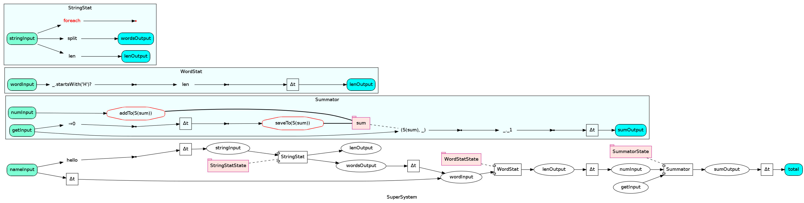

Подсистемы
==========

Система SynapseGrid позволяет использовать подсистемы-модули, которые связываются между собой. Из практики
работы с подсистемами выявились несколько возможностей связи, обладающие своими плюсами и минусами.

1. Использование общего объекта-контакта непосредственно в коде Builder'а, конструирующего подсистемы.
2. Передача объекта-контакта (входного или выходного) в конструктор Builder'у.

Оказалось, что для небольшого числа уникальных подсистем использование общего контакта позволяет с
минимальными усилиями обеспечить передачу данных из одной подсистемы в другую. Общий контакт может быть
задокументирован и помещён в общедоступное место.

В то же время, с ростом системы обнаружились недостатки подхода со встроенным в код Builder'а контактом.

1. Затруднён рефакторинг кода.
2. Затруднено использование нескольких одинаковых экземпляров подсистем

> Подключение нескольких экземпляров подсистем
> --------------------------------------------
>
> Если требуется подключить несколько экземпляров подсистемы, то хотелось бы, чтобы эти экземпляры
> могли быть привязаны к разным входным и выходным контактам. Для этого используются подсистема,
> вложенная в подсистему. В промежуточной подсистеме увязываются входы со входами и выходы с выходами.
> Для этого в builder'е промежуточной подсистемы используются методы mappedInput, mappedOutput,
> inputMappedTo, mapToOutput. Эти методы обеспечивают создание wiring'ов, обеспечивающих связи между
> контактами внешней подсистемы и контактами внутренней подсистемы.

3. Общие контакты оказываются распределены/разбросаны по коду.
4. Общие контакты имеют публичный уровень доступа.

Если же передать общий контакт в конструктор Builder'у, то появляется возможность подключения подсистемы
к любому контакту соответствующего типа. Внутри Builder'а фактический общий контакт нигде явно не указан,
используется просто параметр конструктора. Тем самым упрощается рефакторинг, одновременное использование
нескольких экземпляров подсистем, и организация общих контактов. Общие контакты в таком варианте могут
быть объявлены прямо внутри родительской системы и доступ к ним может быть ограничен в соответствии с
потребностями организации кода.

Организация хранения общих контактов
------------------------------------

При использовании модуля в нескольких родительских системах часто приходится сталкиваться с тем, что
общие контакты всякий раз создаются заново, что приводит к copy-paste'у и затрудняет рефакторинг.
Чтобы избежать пересоздания контактов, можно следовать такому способу организации кода:

<pre>
    class MySystem {
        val input1 = new Contact[Int]("input1")
        val output1 = new Contact[Int]("output1")
        private val system = new MySystemBuilder(this).toStaticSystem
	    def toStaticSystem = system
	}

	class MySystemBuilder(outerInterface:MySystem) extends SystemBuilder {
	    import outerInterface._
	    inputs(input1)
	    outputs(output1)
	    input1.map(_ * 2) >> output1
	}
</pre>

Использовать такую систему достаточно просто:

<pre>
    class ParentSystemBuilder extends SystemBuilder {
        val mySubsystem1 = addSubsystem(new MySystem)
        mySubsystem1.output1.foreach(println)
        someOtherContact >> mySubsystem1.input1

        val mySubsystem2 = addSubsystem(new MySystem)
        mySubsystem2.output1.foreach(println)

    }

</pre>

При необходимости Builder'ы можно вообще инкапсулировать полностью:

<pre>
    class MySystem {
        val input1 = new Contact[Int]("input1")
        val output1 = new Contact[Int]("output1")
        private val system = new SystemBuilder {
            inputs(input1)
            outputs(output1)
            input1.map(_ * 2) >> output1
        }.toStaticSystem
	    def toStaticSystem = system
	}
</pre>

Иерархия систем
---------------

Иногда требуется объявить ряд систем, обладающих сходным интерфейсом
и/или реализацией.

Для этогонам необходимо иметь единственный экземпляр SystemBuilder'а для
всех потомков. Этот экземпляр будет содержать конечную версию системы

<pre>
trait BaseTypedSystem {
	protected val sb = new SystemBuilderWithLogging {}
	private lazy val system = sb.toStaticSystem
	def toStaticSystem = system
}
</pre>

В потомках нам достаточно произвести импорт DSL из sb:

<pre>
trait MySystem1 extends BaseTypedSystem {
    import sb._
    val Input1 = input[Int]("Input1")
    val Output1 = output[Int]("Output1")

    Input1 >> Output1
}

trait MySystem2 extends MySystem1 {
    import sb._
    val Input2 = input[Int]("Input2")
    val Output2 = output[Int]("Output2")

    Input2 >> Output1
    Input2.map(_*2) >> Output2
    Input1.map(_*2) >> Output2
}
</pre>

Если некоторые связи необходимо переопределять, то их можно поместить в
метод (который перекрывается в потомках), а сам метод вызвать перед созданием системы.
Например, так:

<pre>
trait BaseTypedSystem {
	protected val sb = new SystemBuilderWithLogging {}
	protected def defineSystem() {}
	private lazy val system = {
	    defineSystem()
	    sb.toStaticSystem
	}
	def toStaticSystem = system
}

trait MySystem1 extends BaseTypedSystem {
    import sb._
    val Input1 = input[Int]("Input1")
    val Output1 = output[Int]("Output1")

	protected override def defineSystem(){
        Input1 >> Output1
    }
}

trait MySystem2 extends MySystem1 {
    import sb._
    val Input2 = input[Int]("Input2")
    val Output2 = output[Int]("Output2")

	protected override def defineSystem(){
        Input2 >> Output1
        Input2.map(_*2) >> Output2
        Input1.map(_*2) >> Output2
        // super.defineSystem()
    }
}
</pre>

На рисунке изображён пример системы с подсистемами:

